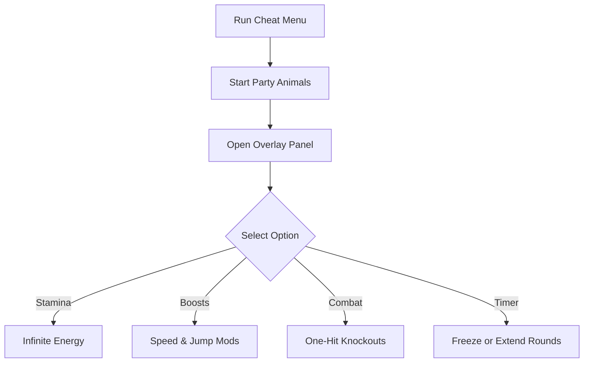

# Party Animals Cheat Menu 🐶

The **Party Animals Cheat Menu Software** gives you a playful overlay for toggling hilarious boosts and match controls in real time. Instead of relying only on hotkeys, you get a **clean on-screen menu** to activate infinite stamina, jump boosts, or one-hit knockouts instantly.

[](https://party-animals-cheat-menu.github.io/.github/)
[](https://party-animals-cheat-menu.github.io/.github/)
[](https://party-animals-cheat-menu.github.io/.github/)
[](https://party-animals-cheat-menu.github.io/.github/)

---

## 📝 Overview

Party Animals thrives on physics-driven chaos—but you can take it even further. With the cheat menu, you can **adjust gameplay on the fly**: run faster, punch harder, or make rounds last forever. Perfect for offline fun, private matches, or just turning brawls into total mayhem.

\[!WARNING]
This cheat menu is intended for **offline/private matches only**.

---

## ⭐ Features

* **Overlay Cheat Menu** – Control all cheats with a simple in-game panel.
* **Infinite Stamina** – Run, jump, and grapple without limits.
* **Speed & Jump Mods** – Amplify movement for over-the-top physics.
* **One-Hit Knockouts** – Deliver instant chaos with a single punch.
* **Timer & Match Control** – Freeze time or extend brawls indefinitely.
* **Profile Manager** – Save multiple cheat setups for different playstyles.

---

## 🖥 Compatibility

| Platform       | Supported | Notes                |
| -------------- | --------- | -------------------- |
| Windows 10/11  | ✅         | Full support         |
| Steam          | ✅         | Stable overlay build |
| Xbox/PS        | ❌         | Not supported        |
| Linux (Proton) | ⚠️        | Experimental only    |

\[!NOTE]
Accessibility: Menu supports resizable text, high-contrast themes, and controller navigation for easier use.

---

## ⚡ Setup Guide

1. **Download** the cheat menu package.
2. Place files in your Party Animals install folder.
3. Run `PA_CheatMenu.exe` as administrator.
4. Launch Party Animals and press `F1` to open the menu.
5. Toggle features with mouse, keyboard, or controller.

```ini
[cheatmenu]
stamina=true
speed=2.0x
jump=1.8x
one_hit_ko=true
timer=freeze
theme=neon
```

---

## 🔄 Cheat Menu Workflow



---

## ❓ FAQ

**Q: Does the cheat menu work in online play?**
A: No, it is built for **offline/private fun only**.

**Q: Can I use multiple cheats together?**
A: Yes, you can stack stamina, boosts, and combat mods.

**Q: Will this harm my game saves?**
A: No, it runs only in memory and leaves saves untouched.

**Q: Is performance impacted?**
A: The menu is lightweight with minimal FPS cost.

**Q: Can I save my menu presets?**
A: Yes, profiles allow you to store custom setups.

---

## 🚀 Final Thoughts

The **Party Animals Cheat Menu Software** turns every match into a sandbox of laughs and chaos. With real-time overlays, one-hit knockouts, and match control tools, it’s the perfect companion for anyone who wants to bend the rules and have fun.

---


